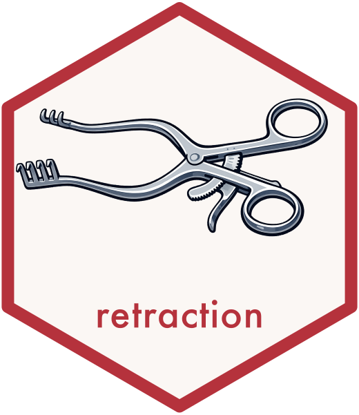

<!-- README.md is generated by hand; edit it directly. -->

# retraction 

<!-- badges: start -->
[](https://CRAN.R-project.org/package=retraction)
[](https://github.com/choxos/retraction/actions/workflows/R-CMD-check.yaml)
[](https://app.codecov.io/gh/choxos/retraction)
[](https://lifecycle.r-lib.org/articles/stages.html#experimental)
[](https://www.gnu.org/licenses/gpl-3.0)
<!-- badges: end -->

`retraction` scans your manuscripts, bibliographies, and reference lists for
citations to retracted papers, so you do not cite discredited work. It reads a
wide range of document and bibliography formats, extracts and normalizes
identifiers, checks them against retraction data, and returns a tidy,
confidence-scored report.

The default data source is the Retraction Watch database, served through the
[XeraRetractionTracker](https://openscience.xera.ac/retractions) API. Crossref
and OpenAlex are available as additional, reconcilable sources.

## Installation

``` r
# Development version from GitHub:
# install.packages("pak")
pak::pak("choxos/retraction")
```

## Quick start

``` r
library(retraction)

# Check a manuscript, bibliography, or reference file.
# Supported: .bib, .ris, .json (CSL), .xml (EndNote/JATS), .docx, .pdf,
# and .Rmd/.qmd/.tex/.md/.txt/.html (DOIs are scraped from the text).
result <- check_file("manuscript.Rmd")
result

# Check a vector of DOIs or PMIDs directly.
check_dois(c("10.1016/S0140-6736(97)11096-0", "10.1038/s41586-020-2649-2"))

# Check a data frame of references (columns are auto-detected).
check_refs(retraction_example)
```

A result is a tidy tibble, one row per reference, with the retraction `status`,
an `is_retracted` flag, a match `confidence`, the `retraction_date`,
`days_since_retraction`, the `reason`, and which `sources` confirmed it. Printing
it gives a compact summary and lists the flagged citations.

## PubMed Central articles

Given a PMID, PMCID, DOI, title, or a whole reference, `check_pmc()` resolves it
to a PubMed Central article, tells you whether the open-access full text is
available, and if so checks that article's reference list for retractions.

``` r
res <- check_pmc(c("PMC5334499", "10.1371/journal.pone.0000217", "29939664"))
pmc_articles(res)   # open-access status, reference count, and retracted count per input
retracted(res)      # the retracted references found
```

## Multiple sources

Every `check_*()` function takes a `sources` argument. The default is `"xera"`
(Retraction Watch). You can query more than one source and have the results
reconciled:

``` r
check_dois("10.1016/S0140-6736(97)11096-0",
           sources = c("xera", "crossref", "openalex"))

list_backends()          # available sources
options(retraction.sources = c("xera", "openalex"))   # set a session default
```

When several sources are queried, the highest-priority match sets the verdict,
every confirming source is recorded, and a `disagreement` flag is raised when
sources do not agree.

## Offline and private use

For bulk checking, privacy (checking an unpublished manuscript sends only DOIs),
or working without a connection, build a local snapshot once and match against
it. Updates are incremental, adding new retractions rather than re-downloading
everything.

``` r
retraction_sync()                       # download once
check_file("manuscript.Rmd", offline = TRUE)
retraction_sync()                       # later: incremental update
```

If your snapshot falls behind the live database, the package tells you when you
run an offline check.

## Reports

``` r
result <- check_file("manuscript.docx")
render_report(result, "report.html")    # self-contained HTML, no extra software
render_report(result, "report.md", format = "md")
```

## How matching works

Matching runs a strict cascade: exact DOI, then PMID (resolved to a DOI via
OpenAlex, since the Retraction Watch API cannot be queried by PMID), then fuzzy
title matching for references that carry no identifier. Exact identifier matches
are asserted with high confidence; fuzzy matches are reported as "possible" so
you can verify them. Fuzzy and PMID matching are most reliable in offline mode,
where the full corpus is available locally.

A citation of a retraction *notice* (rather than of the retracted work) is
recognized and not flagged. A work that was retracted and later reinstated is
reported as reinstated, not flagged.

## Data sources and credits

Retraction data comes from the
[Retraction Watch](https://retractionwatch.com/) database, made openly available
through [Crossref](https://gitlab.com/crossref/retraction-watch-data) and served
by [XeraRetractionTracker](https://openscience.xera.ac/retractions). The optional
Crossref and OpenAlex backends use their public APIs; OpenAlex's `is_retracted`
flag is itself derived from Retraction Watch. See `LICENSE.note` for details.

## License

GPL-3. See [`LICENSE`](LICENSE).
