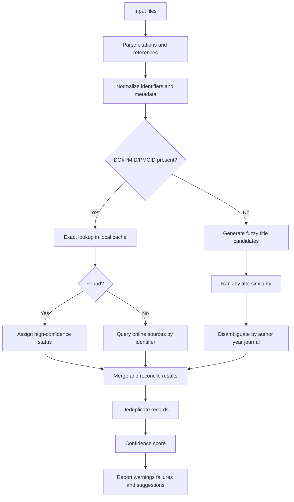
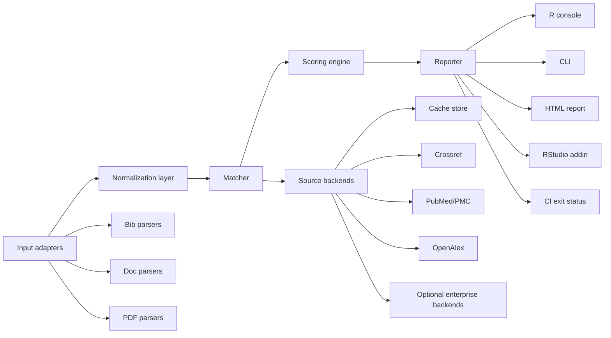

# Designing `retraction` for R

## Executive summary

`retraction` is a strong package name for this project. It is short, memorable, semantically exact, and valid under CRAN naming rules, which require package names to start with a letter, contain only ASCII letters, numbers, and dots, be at least two characters long, and not end in a dot. As of the CRAN package-name index available on July 2, 2026, an exact package named `retraction` does not appear in the current package list. On naming alone, your preference is defensible and, in my view, better than `retractions` because the singular reads more like an infrastructure package than a dataset dump or collection object. citeturn14search0turn25view0

The core design decision should be this: make **Crossref + Retraction Watch the primary truth source**, then use **PubMed/PMC** and **OpenAlex** as secondary corroboration and identifier-enrichment layers. Crossref now exposes Retraction Watch updates in its REST API and also publishes the full Retraction Watch CSV via GitLab; Crossmark covers publisher-deposited updates and can surface status in PDFs and landing pages, but its completeness depends on publisher participation. PubMed is particularly valuable for biomedical records because NLM links original articles to retraction notices. OpenAlex adds a convenient `is_retracted` boolean populated from Retraction Watch and is excellent for fast enrichment, but it should not be your only source of truth. citeturn5view0turn5view1turn35view0turn5view4

The package should not be just a DOI checker. The correct ambition is a **local-first, document-aware citation integrity scanner** that can read bibliographic stores and manuscript formats, normalize citations, resolve identifiers, match them against retraction intelligence, and return a confidence-scored report. Existing tools prove demand but leave a gap that an R-native package can fill: Zotero checks libraries and documents using Retraction Watch; EndNote and Web of Science now surface retraction alerts through Clarivate’s integrations; scite can upload a manuscript PDF and flag retracted or editorially-noticed references. What is still missing is an open, scriptable, reproducible toolchain that works naturally in R/Quarto/CI workflows and that supports bulk checking across `.bib`, office documents, PDFs, LaTeX, and structured scholarly XML. citeturn19view1turn19view2turn18search12

The recommended product path is straightforward. Build an MVP around `.bib`/BibLaTeX, CSL JSON, RIS, `.Rmd`/`.qmd`/Markdown, and `.tex`, with exact DOI/PMID/PMCID matching plus title-based fallback. Then add `.docx`, HTML, JATS XML, EndNote XML, spreadsheets, and PDF reference extraction. Put online APIs behind a modular backend with caching, retries, and optional offline operation from a locally mirrored Retraction Watch/Crossref snapshot. Expose the same engine as R functions, a CLI, an RStudio addin, and GitHub Action/pre-commit integrations. That architecture is robust enough for CRAN and still extensible enough for Shiny dashboards, visual citation graphs, and suggested replacements later. citeturn5view0turn20view0turn35view9turn36view2turn36view3turn36view7

## Retraction intelligence sources and external services

### Recommended source hierarchy

The package should treat retraction detection as a **multi-source reconciliation problem**, not as a single-API lookup. The most reliable stack for a production-quality R package is:

1. **Primary:** Crossref REST API plus a locally mirrored **Retraction Watch CSV**.
2. **Secondary:** PubMed E-utilities for PMID-linked records, and OpenAlex for fast cross-checking and enrichment.
3. **Tertiary / context:** Crossmark, PMC OA content, Unpaywall, publisher APIs, Dimensions, ORCID, and COPE guidance.

This ordering follows how the systems are built. Crossref now incorporates both publisher-deposited Crossmark updates and Retraction Watch updates into the API, with a `source` field distinguishing `publisher` from `retraction-watch`, and it also publishes the full Retraction Watch dataset as a daily updated CSV. PubMed independently links original papers and retraction notices based on journal information. OpenAlex directly exposes `is_retracted` and states that this flag comes from the Retraction Watch database. citeturn5view0turn5view1turn35view0turn5view4

### Source inventory

| Source / service | What it contributes | Access method | Rate limits / operational notes | Licensing / access terms | Reliability for `retraction` | Recommendation |
|---|---|---|---|---|---|---|
| **Crossref REST API** | Crossref metadata plus post-publication updates; retractions available through `update-to`; Retraction Watch updates now included with `source` values such as `publisher` or `retraction-watch` | Public REST API, JSON | Since Dec. 1, 2025: public pool 5 single-record req/s and 1 list req/s; polite pool 10 single-record req/s and 3 list req/s, with concurrency limits. Use `mailto` for the polite pool and cache aggressively. citeturn5view0turn20view0 | Publicly available metadata; premium Metadata Plus exists for higher-volume production use. citeturn5view2turn23search7 | High precision and broad DOI coverage; strongest general-purpose online source, but dependent on DOI ecosystem coverage. citeturn5view0turn23search7 | **Primary online source** |
| **Retraction Watch CSV via Crossref GitLab** | Daily-updated bulk retraction dataset; essential for offline mode and reproducibility | Git clone / CSV import | Updated once per working day; ideal for local cache and offline checks. citeturn5view0turn23search3 | Publicly available; the accessed documentation confirms openness/public availability, but I did not find a machine-readable standalone license statement in the retrieved docs, so redistribution terms should be reviewed before republishing derivative bundles. citeturn5view0turn23search8 | Best bulk source for deterministic local checking; still should be reconciled with API metadata for freshness. citeturn5view0turn23search8 | **Primary offline source** |
| **PubMed / NCBI E-utilities** | PMID-centric retraction links and notice records; especially strong for biomedicine | E-utilities (`esearch`, `esummary`, `efetch`, etc.) | 3 req/s without API key, 10 req/s with key by default. citeturn28search1turn28search2 | Public access to metadata APIs | High precision for indexed biomedical content; lower coverage outside PubMed’s domain. NLM explicitly links original articles and retraction notices. citeturn35view0 | **Secondary authoritative source** |
| **PMC / PMC OA datasets** | PMCID-linked XML/PDF/plain text for extraction, not primarily a retraction-status registry | OA Web Service API, OAI-PMH, E-utilities, BioC, cloud/FTP | OA Web Service legacy file-discovery services are being retired in August 2026 in favor of updated AWS cloud distribution; design adapters accordingly. citeturn35view1 | License varies by article; not all PMC content is reusable; only designated PMC services may be used for automated retrieval. citeturn35view2 | Useful for document parsing and PMCID resolution, not your first retraction-status source. citeturn35view2 | **Secondary for extraction / enrichment** |
| **Crossmark** | Publisher-deposited status mechanism for updates, corrections, retractions | Via Crossref metadata and Crossmark button/dialog in HTML/PDF | No separate public rate-limit issue beyond Crossref API; requires publisher implementation | Depends on publisher participation | High precision when present, but structurally incomplete because publishers must participate and deposit all relevant metadata. citeturn37view0turn37view1 | **Secondary corroboration** |
| **OpenAlex** | Convenient `is_retracted` field, wide metadata graph, DOI/authorship enrichment | REST API and snapshots | Free API key with $1/day free usage; 100 req/s cap; free snapshot updated quarterly; paid plans for higher limits/changefiles. citeturn21view0turn21view1turn21view2 | Dataset is CC0. citeturn21view1 | Excellent enrichment and convenient boolean flag, but derived from Retraction Watch and therefore not independent enough to be sole authority. citeturn5view4 | **Secondary convenience layer** |
| **Unpaywall** | OA-location enrichment for retrieving open versions or repository metadata | REST API | Public API is free; use email parameter. The retrieved official docs do not expose a stable formal rate-limit page in the non-JS interface I could access, so code should treat limits as configurable and conservative. citeturn22search6 | Terms of service govern use; snapshot/data-feed products exist. citeturn22search9turn22search1 | Not a retraction source; useful when you want an accessible full text for reference extraction or notice inspection. citeturn22search6turn22search4 | **Tertiary enrichment only** |
| **Dimensions Analytics API / Author Check API** | Commercial integrity signals, including retracted publications and expressions of concern in Author Check | Subscription APIs | Analytics API limited to 30 req/min per IP; subscription-only. citeturn5view7 | Subscription/product licensing; not open infrastructure. citeturn5view7turn38search1 | Potentially strong for enterprise workflows, but not suitable as the core dependency of a CRAN package. citeturn38search1turn38search2 | **Optional enterprise backend** |
| **ORCID Public API** | Author identity enrichment, not retraction status | Public / member API | Official quota docs indicate rate limits and quotas vary by API tier; ORCID also changed public/anonymous usage quotas in 2025, showing these values are operationally fluid. citeturn5view9turn27view0 | Public API registration required for higher quota | Useful for author disambiguation in ambiguous title matches, but not a retraction detector. citeturn26search14turn26search3 | **Tertiary disambiguation aid** |
| **COPE guidance** | Editorial-policy guidance about retractions, notice quality, and visibility | Web guidance documents | No API; narrative guidance only | Guidance, not structured data | Important for UX wording and classification semantics, but not machine-detectable source data. citeturn9search0turn9search21 | **Policy reference only** |
| **Publisher APIs / landing pages** | May expose notices or article status earlier/more directly than aggregators | Highly heterogeneous | Limits and terms vary; Springer Nature documents explicit rate-limit policies, Elsevier uses key/quota-based access. citeturn10search1turn10search7turn10search0 | Varies by publisher | Useful for dispute resolution and edge cases; too fragmented for first-line matching. | **Fallback / case resolution** |

### Existing tools worth benchmarking

| Tool | What it already does | Design lesson for `retraction` |
|---|---|---|
| **Zotero** | Automatically checks a library and word-processor documents for retracted items, warns on citation insertion/update, and is designed to avoid exposing library contents to the server. Its current matching is strongest for DOI/PMID-bearing items. citeturn19view1 | Your package should copy Zotero’s **privacy posture** and **local matching preference**, but broaden file-format support and make the workflow scriptable. |
| **Clarivate EndNote / Web of Science** | Clarivate now surfaces retraction information across products, integrates Retraction Watch data, creates a “Retractions” group in EndNote, flags retracted references in Word, and excludes citations to/from retracted content from JIF numerators beginning with JCR 2025 release data rules. citeturn19view2turn17search5 | There is a real workflow need at writing time, not only at discovery time. Add Word/CI/report integrations early. |
| **scite Reference Check** | Can upload or inspect manuscripts and flag retracted references and editorial notices. citeturn18search12turn18search7 | There is demand for full-manuscript scanning, not only bibliography-file validation. |
| **Crossmark button in PDFs** | Makes article status visible in PDFs and on landing pages when publishers participate. citeturn37view0turn37view1 | Document-level highlighting is valuable. Your package should emulate that locally by annotating output reports and, where possible, rewritten documents. |

The conclusion is blunt: do not build `retraction` around just one remote API. Build it around a **reconciliation engine** with a **local mirror** and a **pluggable backend registry**.

## File formats and parsing strategy

### What to support beyond `.rmd`, `.qmd`, `.r`, and `.bib`

The best package architecture separates **bibliographic source formats** from **manuscript/container formats**. That distinction matters because bibliographic formats usually preserve identifiers and structure, while manuscript formats often require citation-pattern extraction and reference-block parsing.

| Format family | Specific formats | How to parse in R | Recommended approach | Priority |
|---|---|---|---|---|
| **BibTeX/BibLaTeX** | `.bib`, BibLaTeX variants | `RefManageR`, `bibtex` | Native reading first; this is the easiest high-yield surface. `RefManageR` explicitly supports BibTeX/BibLaTeX `.bib` files and searchable `BibEntry` objects. citeturn36view5 | **Immediate** |
| **Structured reference interchange** | RIS, EndNote XML, CSL JSON, CSL YAML | `RefManageR` for RIS/EndNote XML support, `jsonlite` for CSL JSON | Essential because users move references between managers constantly. Pandoc also reads bibliographic data in BibTeX, BibLaTeX, CSL JSON/YAML, RIS, and EndNote XML. citeturn11search3turn36view6turn11search2 | **Immediate** |
| **Markdown family** | CommonMark, GFM, MultiMarkdown, plain `.md`, `.Rmd`, `.qmd` | Base text parsing plus Pandoc AST when available | Use lightweight regex/tokenization for citation keys and Pandoc for deeper normalized parsing. Pandoc supports many Markdown variants and citations. citeturn35view3turn11search6 | **Immediate** |
| **LaTeX** | `.tex`, `.ltx`, `.cls`-driven manuscripts | Text parsing plus citation-command extraction | Parse `\cite`, `\autocite`, `\parencite`, `\textcite`, `\nocite`, etc., then resolve against bibliography sources. Pandoc can also convert LaTeX for normalization in some workflows. citeturn35view3 | **Immediate** |
| **Office word processing** | `.docx`, `.odt`, `.rtf` | `officer` for `.docx`; Pandoc/system conversion for `.odt`/`.rtf` | For `.docx`, use `officer::read_docx()` and `docx_summary()`. For `.odt`/`.rtf`, prefer Pandoc conversion to an intermediate format if native parsing is too brittle. Pandoc explicitly converts between word-processing and markup formats. citeturn35view4turn35view3 | **High** |
| **PDF** | born-digital scholarly PDFs, manuscript PDFs | `pdftools` first; optional system-call backends to GROBID/CERMINE | `pdftools` gives local text/metadata extraction. For citation/reference extraction from scholarly PDFs, optional backends to GROBID or CERMINE are far better than ad hoc regex alone. GROBID and CERMINE are both designed for scholarly PDF metadata/reference extraction. citeturn35view5turn36view0turn36view1 | **High** |
| **HTML / XML scholarly formats** | HTML, JATS, BITS, DocBook, publisher XML | `xml2` | `xml2` is the correct default for HTML/XML. JATS matters because it preserves reference structure and PMCID/PMID/DOI tags cleanly. Pandoc also supports JATS and DocBook. citeturn35view6turn35view3 | **High** |
| **Reference-manager exports** | Zotero RDF, Mendeley exports, CSV exports | `xml2`, `jsonlite`, `vroom` depending on export | Support the structured exports users can actually obtain, not proprietary internal databases. | **Medium** |
| **Tabular bibliographies** | CSV, TSV, fixed-width, Excel `.xls/.xlsx` | `vroom`, `readxl` | These show up in lab workflows and audits. `vroom` is appropriate for delimited files; `readxl` handles `.xls/.xlsx` without external dependencies. citeturn35view8turn35view7 | **Medium** |
| **Raw identifier lists** | `.txt`, line-delimited DOI/PMID/PMCID lists | Base R | Very easy to support; useful for CLI/CI. | **Immediate** |

### Practical parsing policy

Do not promise perfect parsing symmetry across all source formats. That would be dishonest. A better policy is:

- **Tier A parse fidelity:** `.bib`, BibLaTeX, CSL JSON, RIS, EndNote XML, Markdown, LaTeX.
- **Tier B parse fidelity:** `.docx`, HTML, JATS XML, CSV/XLSX.
- **Tier C parse fidelity:** PDF, because born-digital PDF extraction quality varies by structure and publisher formatting. `pdftools` is the right local default, but scholarly PDF extraction improves materially if GROBID or CERMINE is available as an optional backend. citeturn35view5turn36view0turn36view1

That distinction should appear in documentation and API return values. A user must be able to see whether a file was parsed as **structured**, **semi-structured**, or **heuristic** input. If not, they will trust false certainty.

## Matching and decision engine

### Matching should be hierarchical, not flat

The matching engine should use a strict cascade:

1. **Exact persistent identifiers**
2. **Strong structured metadata match**
3. **Fuzzy title-based candidate set**
4. **Author/year/journal disambiguation**
5. **Confidence scoring and deduplication**

This is the only sane order. DOI, PMID, and PMCID are not equivalent, but they are all stronger than title similarity. PubMed and PMC make identifier linking particularly valuable because retraction notices and original records are explicitly connected. Crossref and OpenAlex also reward identifier-first lookups operationally because they are faster, cheaper, and more precise than broad search. citeturn35view0turn5view4turn21view0

### Recommended normalization rules

Before any matching, normalize all candidate records:

- lowercase
- Unicode normalization
- trim punctuation and repeated whitespace
- DOI canonicalization: strip URL prefixes, lowercase, remove trailing punctuation
- PMID/PMCID canonicalization: strip prefixes, retain normalized type labels
- title normalization: remove bracketed note prefixes such as “Retracted:” or “RETRACTED:” only for comparison, while retaining original strings for reporting
- author normalization: family-name extraction, initials collapsing, `and`/`,` normalization
- year normalization: prefer publication year over online-first date for matching heuristics

That “Retracted:” handling matters because Crossref explicitly recommends reflecting status in the original DOI metadata record by adding “RETRACTED:” in front of the article title. If your matcher does not normalize that, you will miss obvious matches. citeturn37view2

### Recommended confidence model

| Match path | Example evidence | Suggested confidence |
|---|---|---|
| DOI exact match to retracted record | Candidate DOI equals Crossref/OpenAlex/PubMed-linked DOI | **1.00** |
| PMID or PMCID exact match | Candidate PMID/PMCID equals NLM/PMC-linked retracted record | **0.99** |
| DOI missing, exact normalized title + year + first author family match | Strong bibliographic equivalence without PID | **0.95** |
| High title similarity plus author/year agreement | e.g., Jaro-Winkler ≥ 0.96 and publication year ±1 with at least one family-name overlap | **0.80–0.90** |
| Moderate title similarity with sparse metadata | e.g., cosine/q-gram match high but no identifier, weak author information | **0.55–0.75** |
| Weak candidate only | title-only fuzzy hit with conflicting year/journal | **<0.50, report but do not fail by default** |

For R implementation, `stringdist` is the right first dependency because it supports Damerau-Levenshtein, Levenshtein, q-gram, cosine, Jaccard, Jaro, and Jaro-Winkler distances, and `fuzzyjoin` is useful when you want candidate generation over data frames rather than one-off lookups. citeturn36view4turn34search1

### Recommended fuzzy strategy

Do not use one fuzzy metric globally. Use two passes:

- **Candidate generation:** q-gram or cosine distance on normalized title tokens.
- **Candidate ranking:** Jaro-Winkler for near-exact typographic variations, then tie-break with author/year/journal agreement.

This is stronger than raw Levenshtein-only matching because scholarly titles often differ by punctuation, ligatures, spelling variants, and subtitle segmentation rather than pure edit distance. The `stringdist` package exposes precisely the families you need for that staged strategy. citeturn36view4

### Missing and ambiguous identifiers

If DOI is missing but PMID exists, check PubMed first. If PMCID exists without PMID, use PMC/NCBI conversion or linked metadata resolution. If multiple candidate records survive fuzzy filtering, do **not** collapse them silently. Return a disambiguation object with:

- candidate IDs
- source backend
- similarity scores
- matched author tokens
- year differences
- confidence band
- reason the match is unresolved

If the paper is likely retracted but ambiguity remains, the tool should surface **“possible retracted citation”** rather than an unconditional fail. That is the difference between a useful integrity tool and a nuisance alarm.

### Workflow diagram



The important point is that online querying should happen **after** local cache checks, not before. Crossref itself recommends caching results and using bulk files when high-volume retrieval is needed. citeturn20view0

## Features and user experience

### What the package should expose

The package should have one engine and several surfaces:

- **R functions** for programmatic use
- **CLI** for shell and CI usage
- **RStudio addin** for interactive local checking
- **GitHub Action / pre-commit hook** for repository hygiene
- **Quarto/R Markdown linting** for authoring-time feedback
- **Shiny app** for batch review and triage
- **interactive HTML reports** for collaborators and editors

RStudio addins are distributed as R packages, which makes an addin a natural fit rather than an afterthought. citeturn35view9

### Recommended function surface

A clean exported API would look like this:

```r
check_retractions(path, sources = c("crossref", "pubmed", "openalex"))
check_bib(path)
check_doc(path)
check_refs(data_frame)
update_cache()
as_cli()
render_report(result, output = "html")
```

And a lower-level API:

```r
parse_input(path)
normalize_refs(x)
match_refs(x, cache, backends)
score_matches(x)
```

That separation keeps the public interface small and the internals testable.

### Feature prioritization

| Feature | Value | Complexity | Recommended release |
|---|---|---:|---|
| Exact DOI/PMID/PMCID matching | Very high | Low | **MVP** |
| `.bib` / BibLaTeX / CSL JSON / RIS support | Very high | Low–medium | **MVP** |
| `.Rmd` / `.qmd` / Markdown / `.tex` citation extraction | Very high | Medium | **MVP** |
| Local cache + offline mode | Very high | Medium | **MVP** |
| HTML report with confidence scores | High | Medium | **MVP** |
| `.docx` parsing | High | Medium | **v1** |
| GitHub Action / CLI exit codes | High | Medium | **v1** |
| Pre-commit hook | Medium | Low | **v1** |
| RStudio addin | Medium | Medium | **v1** |
| JATS / HTML / EndNote XML support | High | Medium | **v1** |
| PDF reference extraction via `pdftools` | Medium | Medium | **v1** |
| Optional GROBID/CERMINE PDF backend | High | High | **advanced** |
| Citation highlighting in rewritten documents | Medium | High | **advanced** |
| Suggested replacement papers | Medium | High | **advanced** |
| Citation graph visualization | Medium | Medium | **advanced** |
| Shiny review app | Medium | Medium | **advanced** |

### UX principles

The package should never merely say “retracted.” It should report:

- the matched cited item
- the backend(s) that flagged it
- the notice type if available
- the confidence score
- what matched: DOI, PMID, PMCID, title, author/year
- whether the citation text itself acknowledges the retraction

That last feature is worth building. A cited retracted paper is not always an error; sometimes the manuscript is discussing misconduct, replication failure, or the retraction itself. Your reporting logic should distinguish **“retracted citation acknowledged”** from **“retracted citation unacknowledged.”** COPE’s emphasis on visibility and clear notice communication supports that distinction as a meaningful user-facing category. citeturn9search0turn9search21

## Architecture and implementation

### Suggested package architecture



This modular split is not optional. If parsing, matching, and reporting are tangled together, the package will become unmaintainable as soon as you add `.docx` and JATS.

### Recommended dependencies

| Concern | Suggested package(s) | Why |
|---|---|---|
| HTTP client | `httr2`, optionally `curl` | `httr2` is a modern HTTP client for web APIs and builds on `curl`; it already has the right ergonomics for retries, authentication, and request objects. citeturn32search0turn36view2turn32search1 |
| JSON | `jsonlite` | Fast, robust, web-oriented JSON parsing and streaming. citeturn36view6 |
| XML / HTML | `xml2` | `xml2` is the standard libxml2 binding for structured XML/HTML parsing in R. citeturn35view6 |
| PDF | `pdftools` | Local PDF text and metadata extraction via Poppler. citeturn35view5 |
| BibTeX / BibLaTeX / reference management | `RefManageR`, maybe `bibtex` | Native bibliography parsing and bibliography object model. citeturn36view5 |
| Fuzzy matching | `stringdist`, optionally `fuzzyjoin` | String-distance algorithms and inexact joins. citeturn36view4turn34search1 |
| Tabular inputs | `vroom`, `readxl` | Fast CSV/TSV/FWF and native Excel support. citeturn35view8turn35view7 |
| Type stability | `vctrs` | Good for custom structured classes such as `retraction_match` and `retraction_result`. citeturn32search11turn32search3 |
| Documentation | `roxygen2` | Automatic `Rd`/`NAMESPACE` generation from source comments. citeturn36view3 |
| Testing | `testthat` | Standard package testing framework integrated with R workflows and `R CMD check`. citeturn36view7 |
| Interactive tooling | `rstudioapi`, `shiny`, `miniUI` | Appropriate for addins and lightweight local gadgets. Posit documents addins as package-distributed, and Shiny Gadgets are specifically intended for analysis-time interactive tools. citeturn35view9turn31search13turn31search16 |

A small but important design choice: prefer **`httr2` over `httr`** for new development. It is the modern path, and you do not want a fresh package tied to an older wrapper model. citeturn32search0turn36view2

### Backend design

Use an internal backend registry like this:

```r
backend_crossref_lookup()
backend_pubmed_lookup()
backend_openalex_lookup()
backend_crossref_snapshot_lookup()
```

Each backend should return the same normalized schema:

```r
list(
  matched = TRUE,
  source = "crossref",
  source_priority = 1,
  ids = list(doi = "...", pmid = NA, pmcid = NA),
  title = "...",
  status = "retracted",
  notice_type = "retraction",
  status_source = "retraction-watch",
  evidence = c("doi_exact", "update_to"),
  raw = <optional raw payload>
)
```

That allows reconciliation logic to stay source-agnostic.

### Caching, offline mode, and rate-limit handling

For a package like this, caching is not an optimization. It is part of correctness and etiquette. Crossref explicitly recommends caching and using bulk files for high-volume workflows. NCBI has explicit request ceilings. OpenAlex imposes daily credit budgets and a hard requests-per-second ceiling. citeturn20view0turn28search1turn21view0turn21view2

The package should therefore support:

- **persistent cache** keyed by normalized DOI/PMID/PMCID/title hash
- **cache freshness policy** per backend
- **offline mode** using local Crossref/Retraction Watch mirror
- **exponential backoff** for HTTP 429/5xx
- **request throttling** per backend
- **batch lookups** where supported

OpenAlex explicitly recommends OR-syntax batching and exponential backoff; Crossref distinguishes single-record and list request pools; NCBI keys increase supported request rates from 3 req/s to 10 req/s. citeturn21view0turn20view0turn28search1

### Concrete API examples

The following are sensible building blocks.

Crossref retraction query:

```bash
curl "https://api.crossref.org/v1/works?filter=update-type:retraction&rows=5&mailto=you@example.org"
```

Crossref says `filter=update-type:retraction` returns retractions, and its Retraction Watch integration places update information in `update-to` with a `source` field. citeturn5view0turn10search2

OpenAlex DOI lookup:

```bash
curl "https://api.openalex.org/works?filter=doi:10.1002/cphy.cp010129&select=id,doi,title,is_retracted&api_key=YOUR_KEY"
```

OpenAlex documents `is_retracted` on Work objects. citeturn5view4turn21view0

PubMed summary lookup:

```bash
curl "https://eutils.ncbi.nlm.nih.gov/entrez/eutils/esummary.fcgi?db=pubmed&id=12345678&retmode=json&api_key=YOUR_NCBI_KEY"
```

NCBI documents E-utilities as the public API for PubMed and related databases. citeturn28search4turn28search1

### Example R skeleton

```r
library(httr2)
library(jsonlite)

crossref_retraction_lookup <- function(doi, mailto = NULL) {
  doi <- tolower(gsub("^https?://(dx\\.)?doi\\.org/", "", doi))
  req <- request(sprintf("https://api.crossref.org/v1/works/%s", URLencode(doi, reserved = TRUE)))

  if (!is.null(mailto)) {
    req <- req_url_query(req, mailto = mailto)
  }

  resp <- req |>
    req_user_agent("retraction R package") |>
    req_retry(max_tries = 3) |>
    req_perform()

  obj <- resp_body_json(resp, simplifyVector = TRUE)$message
  updates <- obj$`update-to`

  list(
    doi = doi,
    title = obj$title[[1]],
    updates = updates,
    retracted = !is.null(updates) && any(vapply(updates, function(x) identical(x$type, "retraction"), logical(1)))
  )
}
```

This should live below a wrapper that first checks a local cache and only then makes remote calls.

## Testing, validation, and governance

### Test strategy

Use three layers of tests.

**Unit tests** should cover normalization, parsing, fuzzy scoring, and source adapters in isolation. `testthat` is the right framework for this and integrates naturally with package workflows and `R CMD check`. citeturn36view7

**Golden-file integration tests** should use static fixtures:

- miniature `.bib`, CSL JSON, RIS, and EndNote XML files
- Markdown/Quarto/LaTeX/docx reference cases
- synthetic Crossref/OpenAlex/PubMed JSON responses
- a local excerpt of the Retraction Watch CSV
- PDF fixtures with known extractability classes: easy, medium, pathological

**Live-smoke tests** should be minimal, skipped on CRAN, and run in GitHub Actions only when credentials or network are available.

### What to measure

Your evaluation report should publish at least these metrics:

- identifier extraction rate
- exact-match precision and recall
- fuzzy-match precision, recall, and F1
- unresolved-candidate rate
- false-positive rate on non-retracted controls
- false-negative rate on sampled known retractions
- mean runtime per file and per 1,000 references
- cache hit rate
- backend disagreement rate

That is not bureaucracy. It is how you avoid building a package that feels impressive while quietly being wrong.

### Sample `testthat` patterns

```r
test_that("DOI normalization strips resolver prefixes and punctuation", {
  expect_equal(
    normalize_doi("https://doi.org/10.1234/ABC. "),
    "10.1234/abc"
  )
})

test_that("exact DOI match receives maximum confidence", {
  x <- score_match(match_type = "doi_exact", year_delta = 0, author_overlap = 1)
  expect_equal(x$confidence, 1)
})

test_that("ambiguous fuzzy matches are not auto-promoted to exact", {
  x <- decide_match(
    title_score = 0.91,
    year_delta = 2,
    author_overlap = 0
  )
  expect_true(x$status %in% c("possible", "unresolved"))
})
```

### Security, privacy, and ethics

This package will often be run on unpublished manuscripts. That changes the design requirements.

First, **local-first parsing is mandatory**. Use `pdftools`, `officer`, `xml2`, and text parsing locally whenever possible. Those packages operate on local files rather than requiring uploads. citeturn35view5turn35view4turn35view6

Second, **remote lookups should transmit the minimum necessary data**. By default, transmit only normalized identifiers. If there is no identifier and fuzzy lookup is needed, give users a switch like `allow_remote_title_queries = FALSE` by default for private manuscripts.

Third, **logs must never print full manuscripts or full extracted reference blocks by default**. Store hashes and normalized identifiers instead. Zotero’s privacy-preserving design is a useful benchmark: it was explicitly engineered to avoid letting the server infer whether a specific retracted work is in a user’s library. citeturn19view1

Fourth, **do not overstate certainty**. A package that emits hard failures on low-confidence fuzzy matches will cause users to distrust it, rightly.

## Roadmap, naming, and release strategy

### Recommended roadmap

| Phase | Scope | Estimated effort |
|---|---|---|
| **MVP** | `check_bib()`, `check_doc()` for `.bib`, BibLaTeX, CSL JSON, RIS, Markdown/Quarto/LaTeX; Crossref + local RW CSV + PubMed/OpenAlex backends; exact ID matching; HTML/text report; offline cache; CLI | **6–10 weeks** |
| **v1** | `.docx`, JATS XML, HTML, CSV/XLSX; GitHub Action; pre-commit hook; RStudio addin; better fuzzy matching and disambiguation; acknowledged-vs-unacknowledged reporting | **10–16 weeks total** |
| **Advanced** | PDF scholarly extraction with optional GROBID/CERMINE; Shiny triage app; document annotation/highlighting; suggested alternatives; citation graph visualizations | **4–8 additional months** |

These estimates assume no hard budget or compute constraints, as specified, and a single focused maintainer or small team.

### CRAN and packaging considerations

CRAN compatibility is realistic if you keep the core lean:

- Put heavy or external system integrations such as GROBID/CERMINE behind **`Suggests`** or optional runtime detection.
- Skip network and long-running tests on CRAN.
- Avoid requiring Java, Pandoc, or LibreOffice for package installation.
- Prefer pure-R or common system libraries for the CRAN path; `pdftools` relies on Poppler, which is already a standard CRAN pattern rather than a research-grade one-off dependency. citeturn35view5
- Use `roxygen2` for docs and `testthat` for tests; those are standard package-development tools. citeturn36view3turn36view7

The package should probably live on **GitHub first** and reach CRAN after the MVP API stabilizes. Otherwise you will end up fighting CRAN checks while still changing the object model.

### Naming and branding

`retraction` has the following advantages:

- shorter and cleaner than `retractions`
- singular nouns are common and memorable for infrastructure packages
- directly communicates the purpose
- works well in code: `retraction::check_bib()` reads naturally

`retractions` is weaker because it sounds more like a dataset package than a checking engine. Alternatives such as `retractr`, `citecheckr`, or `retcheck` are more brandable but less semantically exact. Since the exact CRAN package name `retraction` is not present in the current package list, and the name complies with CRAN syntax rules, your stated preference remains the best option unless you discover a trademark or branding conflict in your target distribution context. citeturn14search0turn25view0

On trademarks, the sensible approach is practical rather than dramatic. Public clearance should include the Canadian Trademarks Database and WIPO Global Brand Database, both of which are explicitly designed for trademark searching. I did not retrieve enough evidence here to make a legal clearance statement about `retraction` as a software/service mark, so it would be wrong to claim more than that. If you commercialize the package or build a hosted service around it, do a proper trademark search and, if the stakes matter, get counsel. citeturn15search0turn15search1turn15search11

### Open questions and limitations

A few issues remain genuinely open and should be documented rather than hand-waved away.

The exact downstream redistribution license for the public Retraction Watch CSV as surfaced through Crossref was not explicit in the non-paywalled machine-readable documentation I accessed, even though Crossref and Retraction Watch clearly state that the database is public/openly available. That means you can confidently **use** it, but before bundling or mirroring redistributed subsets inside the package repository itself, review the current terms carefully. citeturn5view0turn23search8

Unpaywall is useful for OA retrieval, but it is not a retraction source, and the non-JavaScript official docs I could access did not expose a crisp public rate-limit page. Treat its limits as configurable and non-core. citeturn22search6turn22search9

Finally, PDF parsing remains intrinsically messy. Even with `pdftools`, GROBID, or CERMINE, you will never get identical reliability across all publisher layouts and image-based PDFs. Your package should say so plainly. A rigorous tool is allowed to admit uncertainty; a sloppy tool pretends uncertainty does not exist.